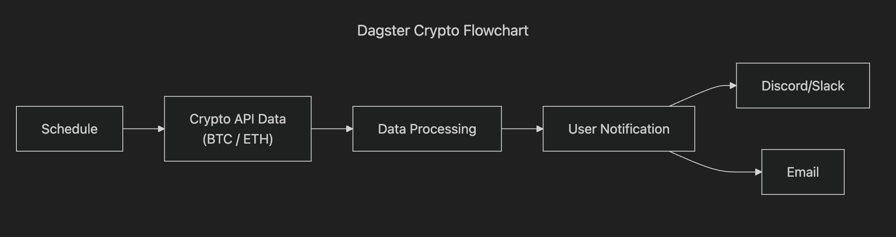

# Dagster Crypto Notification Pipeline

This project provides insights on cryptocurrency using [Dagster](https://docs.dagster.io/) for orchestration. It collects and transforms data from APIs, then sends notifications with key insights via a messaging service.



## Table of Contents

- [API(s) Utilized](#apis-utilized)
- [Getting Started](#getting-started)
  - [Clone the Repo](#clone-the-repo)
  - [Create a Virtual Environment](#create-a-virtual-environment)
  - [Create a .env File](#create-a-env-file)
  - [Detect Secrets Setup](#detect-secrets-setup)
  - [Run Dagster UI](#run-dagster-ui)

---

## API(s) Utilized

- **[Crypto Compare](https://cryptocompare.com)** – Provides data on cryptocurrencies (e.g., price, volume, percentage change).
  > **Note:** This API is free up to **11,000 calls per month**.

- Discord Bot API - Provides messaging ability to specified Discord server.

---

## Getting Started
Follow these instructions to experiment with the project yourself.
### Clone the Repo
Copy the repo locally.

```
git clone https://github.com/jharring17/dagster_crypto_pipeline.git <folder_path>
```

### Create a Virtual Environment
Enter the folder when the project was cloned.

```
cd <path_to_project_folder>
```

Create a virtual env to manage dependencies.

```
python -m venv <virtual_env_name>
```

Activate the virtual env.

```
source <virtual_env_name>/bin/activate # For Mac/Linux
```

Install the dependencies listed within the repo.

```
pip install -r requirements.txt
```

To check all packages successfully installed, list them.

```
pip list
```

### Create a .env File
In the project root directory, create a .env file.

```
touch .env
```

Enter the API credentials within the file.

```
VAR_NAME="value"
```
### Detect Secrets Setup
To prevent exposing secrets, detect-secrets must be configured and initialized.

```
detect-secrets scan > .secrets.baseline
```
  > **Note:** Additional information for configuration can be found here [detect-secrets GitHub](https://github.com/Yelp/detect-secrets)

### Run Dagster UI
Execute the following command within the project.

```
dagster dev
```

The UI will now be accessible at [localhost](localhost:3000).
